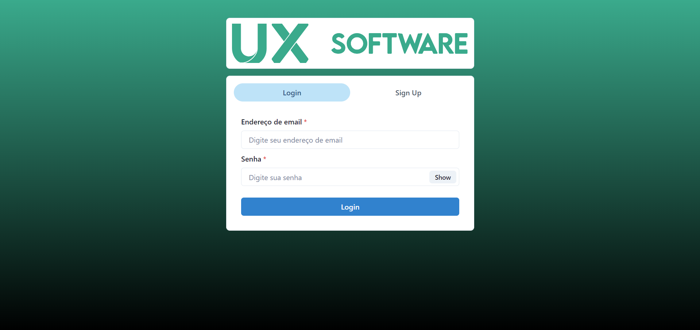
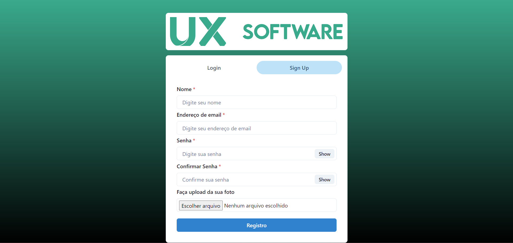
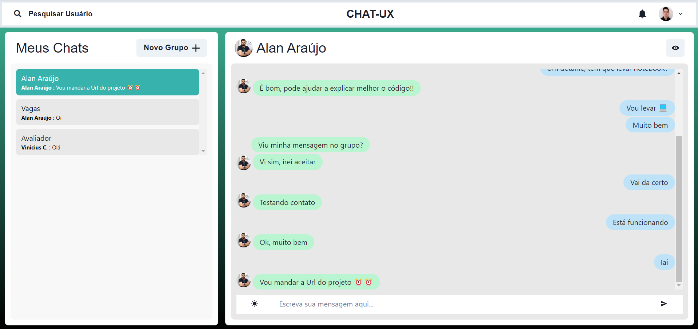
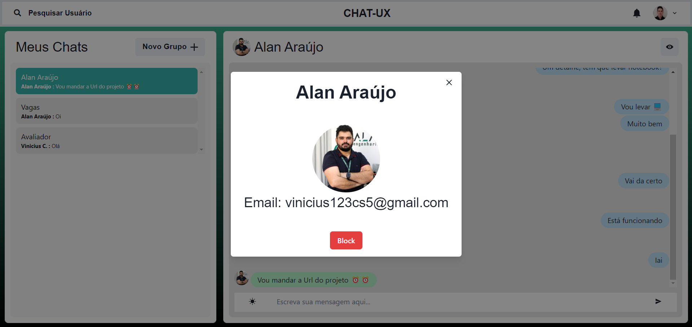
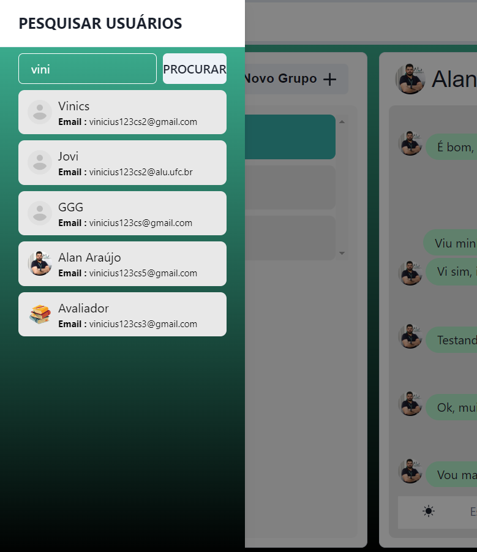
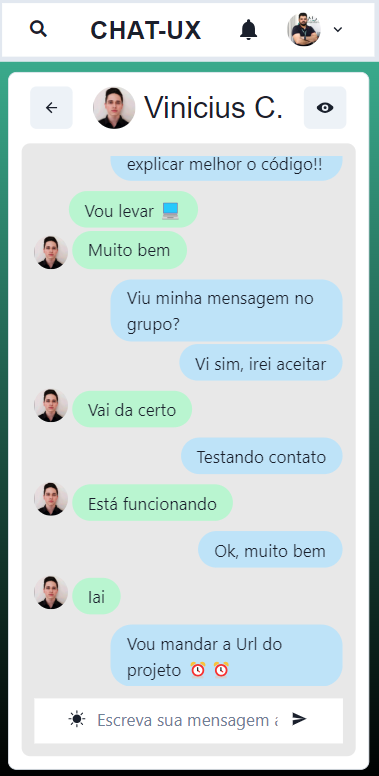

# Chat-UX
Chat com implementação de Websocket, ReactJs e MongoDB

Chat para Desafio da UX com essas funcionalidades -
- Compartilhamento de dados em tempo real usando Socket.io
- Opção eficiente de pesquisa de usuários
- Recurso de criação de grupo
- Adicionar, excluir e renomear funcionalidade por administrador de grupo
- Configuração de notificação
- Bloquear usuários

## Tecnologias utilizadas
1. React.js
2. Node.js
3. MongoDB
4. Socket.io

---

## Página de Login

## Página de Registro

## Página do Chat

## Página de Perfil

## Pesquisa de Usuários

## Criação de Grupo

## Edição de Grupo

## Mobile

---

Como rodar:

Na pasta raiz e na pasta frontend execute:

npm i

Novamente na pasta Raiz, primeiramente, e depois na pasta frontend, execute o comando:

npm start

---

<i>Contato</i>  
 

